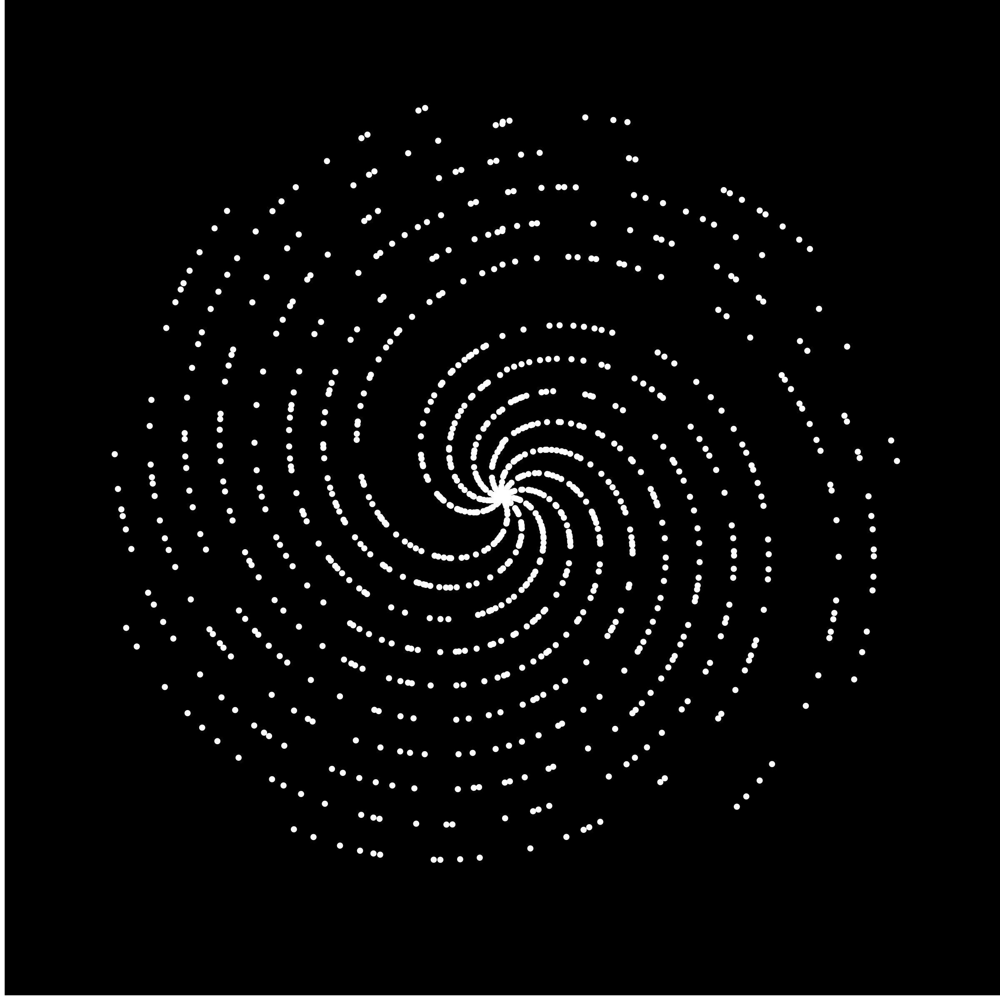

# prime-galaxy

Pretty but pointless patterns in polar plots of prime. Inspired by [3Blue1Brown's excellent video](https://www.youtube.com/watch?v=EK32jo7i5LQ). Here are the first 1000 primes plotted with n = θ = magnitude:

And here are the first 100,000 primes

